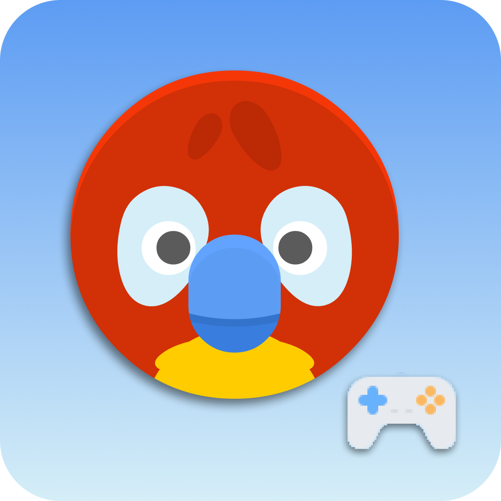
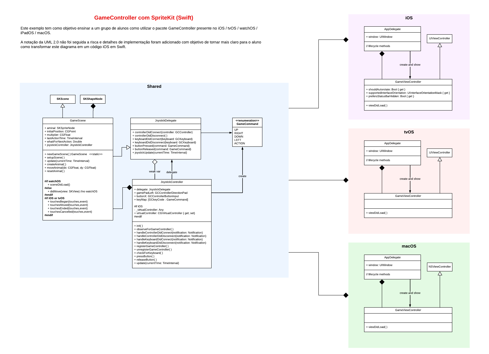
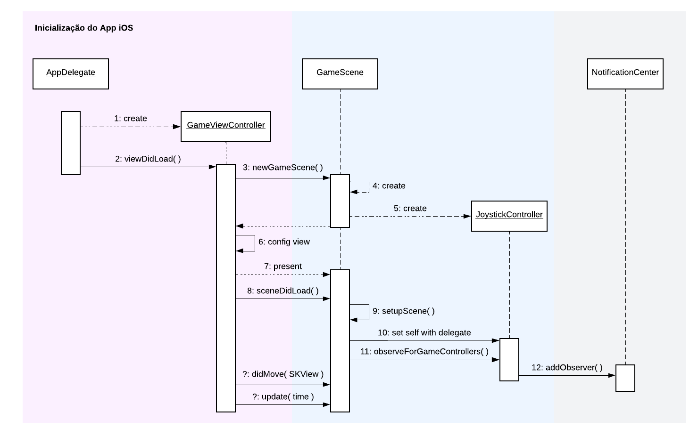
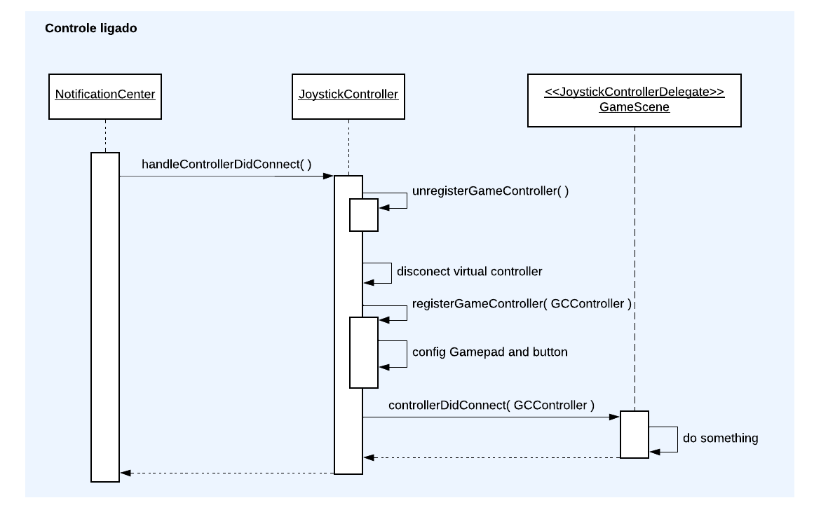

 

<h3 align="center">Base Controller</h3>

---

  Projeto do Xcode em SpritKit e Swift para demonstração do uso de Gamecontroller no novo iOS. Este projeto tem suporte para iOS, iPadOS, WatchOS, tvOS e MacOS
      

## 📝 Tabela de conteúdos

- [Sobre](#about)
- [Como começar](#getting_started)
- [Autores](#authors)
- [Estrutura do Projeto](#project)

## 🧐 Sobre 

Este é um projeto simples para demonstração de uso do de Gamecontroller nos dispositivos da Apple. Além disso, já faz uso do gamecontroller virtual.

O código foi estruturado para melhor coesão do código, definindo classes/structs com responsabilidades específicas.

## 🏁 Como começar 

Para que o projeto funcione corretamente é necessário adicionar em cada um dos targets a conta de desenvolvedor. Feito isso já é possível compilar o código e rodar no dispositivo.

A experiência fica melhor se você tiver um controle ligado para poder testar :)

## ✍️ Autores 

- [@phcacique](https://github.com/phcacique) - Ideia, pesquisa e versão incial
- [@joaquimp](https://github.com/joaquimp) - Ajustes para uso em aula

## 🎮 Estrutura do Projeto

 

Para melhor entendimento desenvolvemos um diagrama de classe com base neste projeto com fins didáticos. Não seguimos fielmente a UML 2.0, pois incluímos detalhes de implementação em Swift para dar suporte a multiplataforma.

Os diagramas de sequência também não são exaustivos, tem como finalidade mostrar alguns cenários, visto que os demais seguem basicamente o mesmo fluxo.

### Diagrama de Classes

### Diagramas de Sequência

